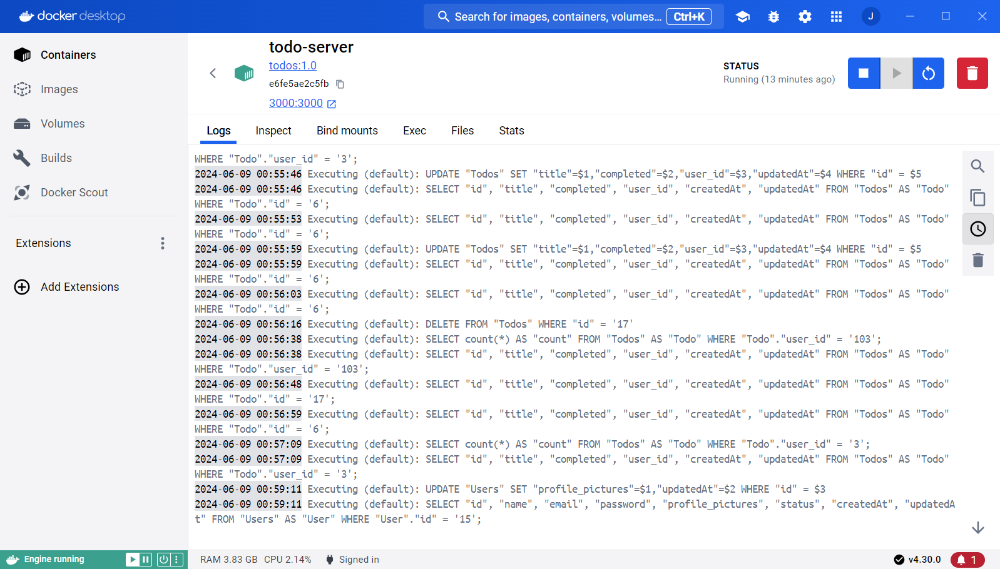

# Unit Testing & Deployment

## Table of contents

- [Overview](#overview)
  - [The challenge](#the-challenge)
  - [Documentation](#documentation)
  - [Links](#links)
- [My process](#my-process)

## Overview

### The challenge

- Mengintegrasikan unit testing pada project api
- Menjalankan aplikasi project api menggunakan docker
- Mengimplementasikan project api menggunakan gitlab ci/cd

### Documentation

### Links

- Solution file: [solution_file](app.js)

## My process

- Instalasi semua package yang dibutuhkan dan buatlah struktur untuk project API
- Mulai membuat api menggunakan express js serta sequelize serta jalankan api menggunakan dockerfile dan docker compose
- Setup api menggunakan gitlab CI/CD
- Pastikan API yang menggunakan docker dapat berjalan dengan baik
